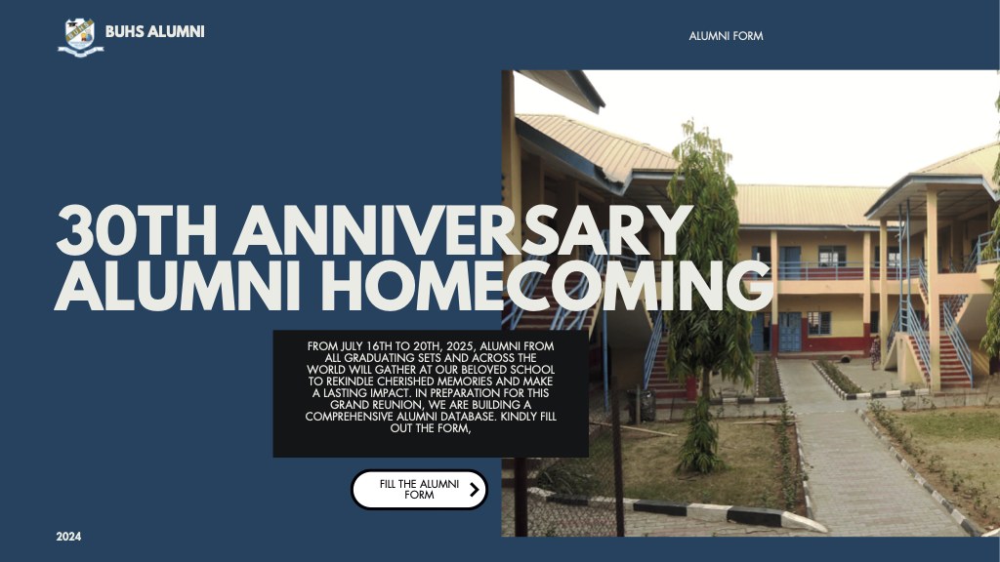

# 🎓 Babcock University High School Alumni Homecoming 🎉



Welcome to the official website repository for the **30th Anniversary Alumni Homecoming** of **Babcock University High School**! This project is dedicated to celebrating decades of excellence, fostering alumni connections, and making a lasting impact on our beloved institution.  

---

## 🌟 About the Project  
This website serves as a central hub for alumni engagement, including:  
✅ **Alumni Registration Form** – Help us build a comprehensive alumni database  
✅ **Event Details** – Stay updated on the homecoming schedule  
✅ **Donation Portal** – Contribute to future alumni projects  
✅ **Gallery** – Relive cherished memories  

---

## 📌 Features  
- **Modern & Responsive Design** 📱💻  
- **Dark Translucent Banner Overlay** 🎨  
- **Mobile-Friendly Navigation (Hamburger Menu)** 🍔  
- **Smooth User Experience** 🚀  

---

## 🛠️ Installation & Usage  
To run this project locally:  
1. Clone the repository:  
   ```sh
   git clone https://github.com/your-repo/babcock-alumni-homecoming.git
   ```
2. Open index.html in a browser.

---

## 🎉 Special Thanks
A huge appreciation to the Babcock University High School management and her Alumni Association for making and planning the event 🙌 Your dedication and commitment to keeping the alumni network alive are truly commendable.

Together, we make a difference! ❤️💙

## 📩 Stay Connected: https://alumni.buhs.sch.ng
